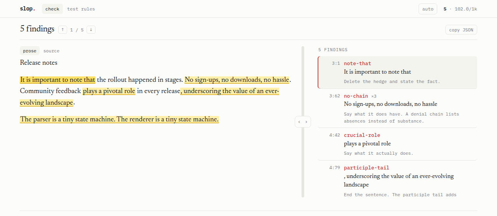

# slop

A linter for prose. It flags the phrasings language models overproduce, at the
line they came from, with the fix.

**[Try it in your browser →](https://bheijden.github.io/slop/)**

You asked a model for release notes. It gave you this:

<!-- slop-ignore-start -->
> It is important to note that the rollout happened in stages. No sign-ups, no
> downloads, no hassle. Community feedback plays a pivotal role in every
> release, underscoring the value of an ever-evolving landscape.
>
> The parser is a tiny state machine. The renderer is a tiny state machine.
<!-- slop-ignore-end -->

It reads fine and says almost nothing. `slop` shows you where:

```console
$ slop check release-notes.md

release-notes.md (49 words, 5 findings)
  3:1       note-that             It is important to note that
            fix: Delete the hedge and state the fact.
  3:62      no-chain          ×3  No sign-ups, no downloads, no hassle
            fix: Say what it does have. A denial chain lists absences instead of substance.
  4:42      crucial-role          plays a pivotal role
            fix: Say what it actually does.
  4:79      participle-tail       , underscoring the value of an ever-evolving landscape
            fix: End the sentence. The participle tail adds commentary, not information.
  7:1       echo-triad        ×2  The parser is a tiny state machine. The renderer is …
            fix: Merge the parallel sentences into one, or vary the structure.

5 findings in 1 file, 49 words, 102.04 per 1000 words
```

Or drop the file on [the page](https://bheijden.github.io/slop/). Same engine,
same rules, nothing uploaded:

<p align="center">
  <picture>
    <source media="(prefers-color-scheme: dark)" srcset="docs/img/slop-dark.png">
    
  </picture>
</p>

## Run it

```sh
# one-off, nothing installed
npx --yes github:bheijden/slop check docs/ -r

# repeated use, about 25x faster to start
git clone --depth 1 https://github.com/bheijden/slop
node slop/js/cli.mjs check docs/ -r
```

No dependencies. Needs only Node. Works on `.md`, `.html`, `.txt` and `.rst`,
and on whole directories.

Findings never fail a run on their own. Set a budget when you want CI to stop
on them:

```sh
slop check --max-per-1000 2 docs/ -r     # exit 1 above 2 per 1000 words
slop check --format json docs/ -r        # for agents and scripts
```

## Rules

Three sets ship on:

| set | rules | |
|---|---|---|
| `simonwillison` | 27 | Stock phrasings, from Simon Willison's [LLM cliché highlighter](https://tools.simonwillison.net/llm-cliche-highlighter) |
| `wikipedia-ai` | 11 | Wikipedia's [Signs of AI writing](https://en.wikipedia.org/wiki/Wikipedia:Signs_of_AI_writing) |
| `load-bearing` | 1 | How far a document's vocabulary spreads across the group that arrived in [louisabraham/load-bearing](https://github.com/louisabraham/load-bearing), rebuilt from upstream daily |
| `ai-tells` | 78 | Tells this project gathered itself, each recording where it came from and how it scored against a matched human/AI corpus |

Every rule in those four runs. A rule that never fires on your register costs
nothing to leave on, so nothing is held back for being narrow. The five patterns
the audit measured firing on human prose and not on AI prose do fire, so they sit
in `candidates/unreproduced.json` instead, off. The five `style-` sets are off
too, and match a register rather than hunting tells.

Rules are data. A set is a JSON file carrying its own test examples (the fudger
runs them, rewritten 27 ways), so adding one never means touching the linter.

**A finding means a phrase is worn, not that a machine wrote it.** Human writers
produce all of these.

## Documentation

| | |
|---|---|
| [Command line](docs/cli.md) | flags, output formats, exit codes, agent usage |
| [Rules](docs/rules.md) | choosing, installing, and writing your own |
| [Writing styles](docs/styles.md) | matching a register instead of hunting tells |
| [Agent skill](docs/skill.md) | installing slop so a coding agent picks it up |
| [The web page](docs/web.md) | what the browser version does |
| [How a file is read](docs/extraction.md) | markup stripping and offset mapping |

## Further reading

How well any of this works is an open question, and the research says less than
the confident tone of most word lists suggests.

| | |
|---|---|
| [Measuring AI "Slop" in Text](https://arxiv.org/abs/2509.19163) | Shaib et al., 2026. Eleven-code taxonomy; finds that reasoning models fail at extracting slop spans too |
| [How to Spot AI Writing](https://www.economist.com/culture/2026/07/30/how-to-spot-ai-writing) | The Economist, 2026. 55,940 sentences against four models. Kills the em-dash tell |
| [Delving into LLM-assisted writing](https://pmc.ncbi.nlm.nih.gov/articles/PMC12219543/) | Kobak et al. 15.1M PubMed abstracts with a real pre-2022 baseline |
| [sloptells.com](https://sloptells.com) | Tells measured against register-matched human writing, each dated |
| [What the rules here actually score](research/audit.md) | This project audited against 18 matched human/AI document pairs |
| [Where each rule came from](research/log.md) | Every source surveyed, and what was rejected |

## Provenance and license

Apache 2.0. See [LICENSE](LICENSE) and [NOTICE](NOTICE). Rule patterns derive
from [simonw/tools](https://github.com/simonw/tools), also Apache 2.0; a pinned
copy lives in `vendor/`. The `wikipedia-ai` set is adapted from Wikipedia's
[Signs of AI writing](https://en.wikipedia.org/wiki/Wikipedia:Signs_of_AI_writing),
CC BY-SA 4.0.
