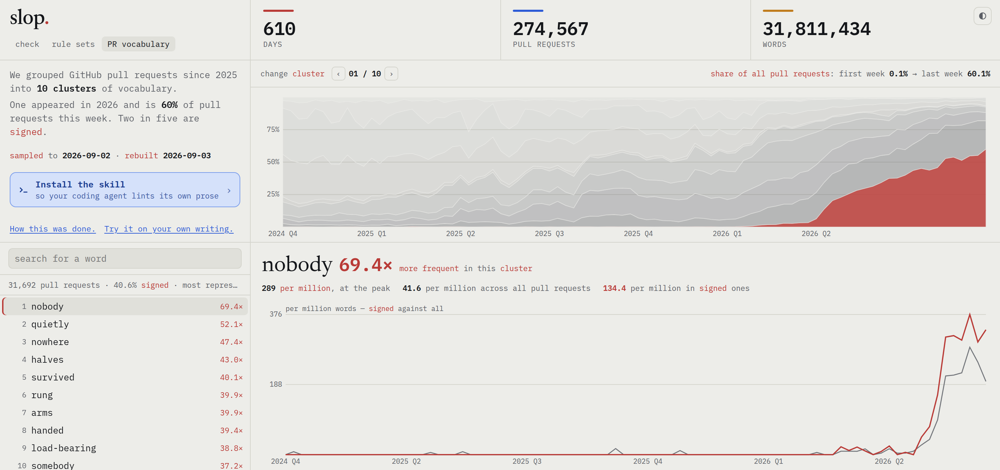

# slop

A linter for prose. It flags the phrasings language models overproduce, at the
line they came from, with the fix.

**[Try it in your browser →](https://bheijden.github.io/slop/)**

You asked a model for release notes. It gave you this:

<!-- slop-ignore-start -->
> It is important to note that the rollout happened in stages. No sign-ups, no
> downloads, no hassle. Community feedback plays a pivotal role in every
> release, underscoring the value of an ever-evolving landscape.
>
> The parser is a tiny state machine. The renderer is a tiny state machine.
<!-- slop-ignore-end -->

It reads fine and says almost nothing. `slop` shows you where:

```console
$ slop check release-notes.md

release-notes.md (49 words, 5 findings)
  3:1       note-that             It is important to note that
            fix: Delete the hedge and state the fact.
  3:62      no-chain          ×3  No sign-ups, no downloads, no hassle
            fix: Say what it does have. A denial chain lists absences instead of substance.
  4:42      crucial-role          plays a pivotal role
            fix: Say what it actually does.
  4:79      participle-tail       , underscoring the value of an ever-evolving landscape
            fix: End the sentence. The participle tail adds commentary, not information.
  7:1       echo-triad        ×2  The parser is a tiny state machine. The renderer is …
            fix: Merge the parallel sentences into one, or vary the structure.

5 findings in 1 file, 49 words, 102.04 per 1000 words
```

Or drop the file on [the page](https://bheijden.github.io/slop/). Same engine,
same rules, nothing uploaded:

<p align="center">
  <picture>
    <source media="(prefers-color-scheme: dark)" srcset="docs/img/slop-dark.png">
    
  </picture>
</p>

## Run it

```sh
# one-off, nothing installed
npx --yes github:bheijden/slop check docs/ -r

# repeated use, about 25x faster to start
git clone --depth 1 https://github.com/bheijden/slop
node slop/js/cli.mjs check docs/ -r
```

No dependencies. Needs only Node. Works on `.md`, `.html`, `.txt` and `.rst`,
and on whole directories.

Findings never fail a run on their own. Set a budget when you want CI to stop
on them:

```sh
slop check --max-per-1000 2 docs/ -r     # exit 1 above 2 per 1000 words
slop check --format json docs/ -r        # for agents and scripts
```

## Rules

Five sets ship on:

| set | rules | |
|---|---|---|
| `pr-vocabulary` | 1 | A list of ordinary words derived from public GitHub pull requests and rebuilt weekly. See [vocabulary.md](docs/vocabulary.md) |
| `simonwillison` | 27 | Stock phrasings, from Simon Willison's [LLM cliché highlighter](https://tools.simonwillison.net/llm-cliche-highlighter) |
| `wikipedia-ai` | 11 | Wikipedia's [Signs of AI writing](https://en.wikipedia.org/wiki/Wikipedia:Signs_of_AI_writing) |
| `load-bearing` | 1 | How far a document's vocabulary spreads across the group that arrived in [louisabraham/load-bearing](https://github.com/louisabraham/load-bearing), rebuilt from upstream daily |
| `ai-tells` | 78 | Tells this project gathered itself, each recording where it came from and how it scored against a matched human/AI corpus |

It overlaps `load-bearing` by about a third of its words and, on the 24-pair
corpus, catches nothing that rule misses. Both ship on because the lists are
derived differently and may separate on text unlike that corpus; run with
`--select` to see either alone.

Every rule in those five runs. A rule that never fires on your register costs
nothing to leave on, so nothing is held back for being narrow. The five patterns
the audit measured firing on human prose and not on AI prose do fire, so they sit
in `candidates/measured-backwards.json` instead, off. The five `style-` sets are off
too, and match a register rather than hunting tells.

Rules are data. A set is a JSON file carrying its own test examples (the fudger
runs them, rewritten 27 ways), so adding one never means touching the linter.

**A finding means a phrase is worn, not that a machine wrote it.** Human writers
produce all of these.

## The derived vocabulary

Four of the five sets are patterns somebody wrote down. `pr-vocabulary` is
measured, and it rebuilds itself.

The method is [Louis Abraham's](https://louisabraham.github.io/load-bearing/),
reproduced here with three changes. Where he picks the cluster to publish by
watching it grow, this picks the one whose descriptions most often carry a
tool's signature. His output is a word list; this is a rule with a threshold, so
it runs over your own writing. And it re-derives itself every week.

Every morning it samples a day of public pull request descriptions, with bots
and non-English dropped and the tool's signature cut off before a single word is
counted. Every Monday it clusters the whole archive, now **610 days and 274,567
descriptions**, into ten groups by vocabulary alone. The clustering never sees
which descriptions are signed.

One of those ten is 41% signed, against 12% for the next. That is the machine
register, found without being told where to look, and its most characteristic
words are the list the rule ships:

<!-- slop-ignore-start -->
`nobody`, `quietly`, `plainly`, `genuinely`, `load-bearing`, `indistinguishable`
<!-- slop-ignore-end -->

[The page](https://bheijden.github.io/slop/web/vocabulary.html) shows all ten
clusters, how each grew, and every word's rate over time, signed against all:

<p align="center">
  <picture>
    <source media="(prefers-color-scheme: dark)" srcset="docs/img/vocabulary-dark.png">
    
  </picture>
</p>

Two things worth knowing before trusting it. The signature says a description
was written by a machine; it does not say the unsigned ones were written by
people, so it is used in exactly one place, choosing which cluster to publish,
and never to rank the words. And the ranking contrasts that cluster against the
rest of the corpus, which has to be mostly human to mean anything: it was 99.9%
human in early 2025 and is about half machine now. Fitted on recent data alone
the method collapses from 22 of 24 to 2. [k-and-window.md](research/k-and-window.md)
has the measurements; [vocabulary.md](docs/vocabulary.md) explains how it is
built.

## Documentation

| | |
|---|---|
| [Command line](docs/cli.md) | flags, output formats, exit codes, agent usage |
| [Rules](docs/rules.md) | choosing, installing, and writing your own |
| [Derived vocabulary](docs/vocabulary.md) | the one rule set that derives itself, daily, from GitHub |
| [The back-testing corpus](data/corpus/README.md) | 24 topics written twice, once by a person and once by a machine |
| [Writing styles](docs/styles.md) | matching a register instead of hunting tells |
| [Agent skill](docs/skill.md) | installing slop so a coding agent picks it up |
| [The web page](docs/web.md) | what the browser version does |
| [How a file is read](docs/extraction.md) | markup stripping and offset mapping |

## Further reading

How well any of this works is an open question, and the research says less than
the confident tone of most word lists suggests.

| | |
|---|---|
| [Measuring AI "Slop" in Text](https://arxiv.org/abs/2509.19163) | Shaib et al., 2026. Eleven-code taxonomy; finds that reasoning models fail at extracting slop spans too |
| [How to Spot AI Writing](https://www.economist.com/culture/2026/07/30/how-to-spot-ai-writing) | The Economist, 2026. 55,940 sentences against four models. Kills the em-dash tell |
| [Delving into LLM-assisted writing](https://pmc.ncbi.nlm.nih.gov/articles/PMC12219543/) | Kobak et al. 15.1M PubMed abstracts with a real pre-2022 baseline |
| [sloptells.com](https://sloptells.com) | Tells measured against register-matched human writing, each dated |
| [What the rules here actually score](research/audit.md) | This project audited against 18 matched human/AI document pairs |
| [Where each rule came from](research/log.md) | Every source surveyed, and what was rejected |

## Provenance and license

Apache 2.0. See [LICENSE](LICENSE) and [NOTICE](NOTICE). Rule patterns derive
from [simonw/tools](https://github.com/simonw/tools), also Apache 2.0; a pinned
copy lives in `vendor/`. The `wikipedia-ai` set is adapted from Wikipedia's
[Signs of AI writing](https://en.wikipedia.org/wiki/Wikipedia:Signs_of_AI_writing),
CC BY-SA 4.0.
